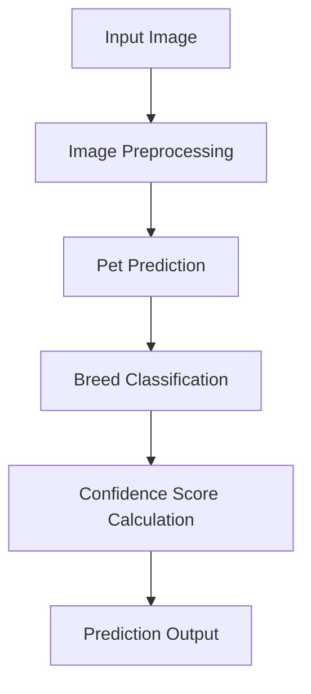
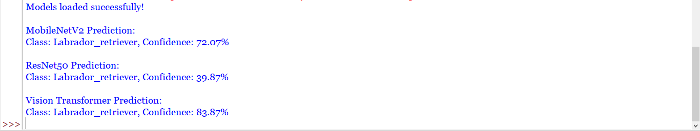

<p align="center">
  
</p>

<h1 align="center">
ROBUST PET IMAGE Prediction SYSTEM
</h1>

<p align="center">
A Deep Learning-Based Pet Prediction and Breed Classification System
</p>

<p align="center">


</p>

---

## 📚 Table of Contents

- [Overview](#overview)
- [Features](#features)
- [Technology Stack](#technology-stack)
- [Dataset](#dataset)
- [System Architecture](#system-architecture)
- [Installation](#installation)
- [Supported Prediction Classes](#supported-Prediction-classes)
- [Screenshots](#screenshots)
- [Performance Highlights](#performance-highlights)
- [Roadmap](#roadmap)
- [Future Scope](#future-scope)
- [Project Structure](#project-structure)

---

<div id="overview">

## 📖 Overview

The **Robust Pet Image Prediction System** is a Deep Learning-powered image analysis application designed to detect and classify pets from static images.

Using advanced Computer Vision and Deep Learning techniques powered by **TensorFlow/Keras**, **PyTorch**, **Torchvision**, and **Pillow**, the system identifies pets within an image, classifies their breed, and displays confidence scores.

The model is trained on a curated **Kaggle Pet Dataset** containing multiple pet categories and breeds, enabling accurate image-based recognition across diverse environments and image qualities.

### Applications

- Pet Identification Systems
- Animal Shelter Management
- Veterinary Assistance
- Pet Breed Recognition
- Smart Image Classification Solutions

</div>

---

<div id="features">

## ✨ Features

- 🐶 Pet Prediction from Images
- 🐱 Multi-Class Pet Classification
- 🐰 Breed Identification
- 🎯 Confidence Score Display
- 🖼️ Single Image Prediction
- 🐾 Multiple Pet Prediction
- 🧠 Deep Learning Powered Classification
- 🔍 High Accuracy Recognition

</div>

---

<div id="technology-stack">

## 🛠️ Technology Stack

| Technology | Purpose |
|------------|----------|
| Python 3.13 | Core Programming Language |
| Torchvision | Deep Learning Models |
| PyTorch | Model Development |
| NumPy | Numerical Computation |
| Matplotlib | Visualization |
| Kaggle Dataset | Training Data |

</div>

---

<div id="dataset">

## 📂 Dataset

The project utilizes a Kaggle Pet Dataset containing:

- Dogs
- Cats
- Rabbits
- Birds
- Hamsters
- Other Domestic Pets

### Dataset Features

- High Resolution Images
- Multiple Breeds
- Various Backgrounds
- Indoor & Outdoor Images
- Diverse Lighting Conditions

</div>

---

<div id="system-architecture">

## ⚙️ System Architecture



</div>

---

<div id="installation">

## 🚀 Installation

### Clone Repository

```bash
git clone https://github.com/YourUsername/Robust-Pet-Image-Prediction-System.git
```

### Navigate to Project Directory

```bash
cd Robust-Pet-Image-Prediction-System
```

### Install Dependencies

```bash
pip install -r requirements.txt
```

### Run Prediction

```bash
python detect_image.py
```

### Train the Model

```bash
python train.py
```

</div>

---

<div id="supported-Prediction-classes">

## 🐾 Supported Prediction Classes

| Pet Type | Breed Classification |
|-----------|----------------------|
| Dog | Supported |
| Cat | Supported |
| Rabbit | Supported |
| Bird | Supported |
| Hamster | Supported |
| Other Pets | Expandable |

</div>

---

<div id="screenshots">

## 📸 Screenshots

### Pet Prediction Example


### Breed Classification Example


### Output Prediction



</div>

---

<div id="performance-highlights">

## ⚡ Performance Highlights

- High Accuracy Pet Prediction
- Accurate Breed Classification
- Multi-Pet Recognition
- Confidence Score Prediction
- Lightweight Deployment
- Efficient Image Processing
- Scalable Architecture

</div>

---

<div id="roadmap">

## 🛣️ Roadmap

### Current Features

- [x] Pet Prediction
- [x] Breed Classification
- [x] Confidence Score Display
- [x] Bounding Box Visualization
- [x] Multi-Class Recognition

### Upcoming Features

- [ ] Mobile Application Integration
- [ ] Cloud-Based Prediction API
- [ ] Pet Health Assessment
- [ ] Animal Age Estimation
- [ ] Pet Emotion Recognition
- [ ] Custom Breed Training

</div>

---

<div id="future-scope">

## 🚀 Future Scope

The project can be extended into advanced AI-powered applications such as:

- Smart Pet Recognition Systems
- Veterinary Diagnostic Assistance
- Automated Animal Shelter Management
- AI-Based Pet Health Analytics
- Breed Recommendation Systems
- Large-Scale Animal Monitoring

</div>

---

<div id="project-structure">

## 📂 Project Structure

```text
Robust-Pet-Image-Prediction-System/
│
├── dataset/
│   ├── imagenet_class_index.json
│
├── screenshots/
│
├── IMAGE PREDICTION.py
│
├── requirements.txt
└── README.md
```

</div>

---

<p align="center">
⭐ If you found this project useful, consider giving it a star!
</p>
